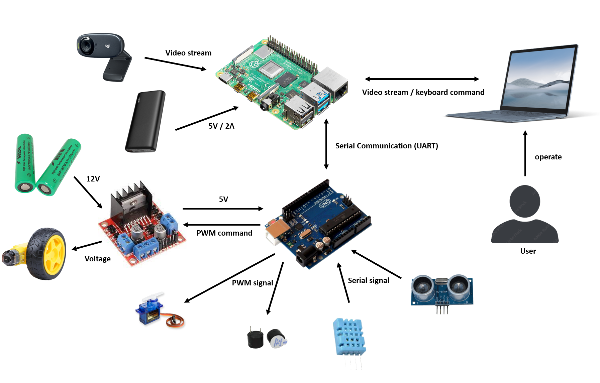
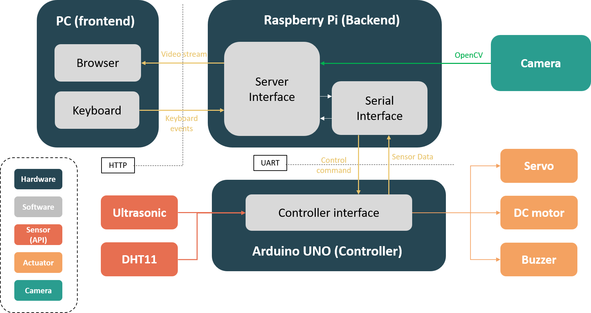
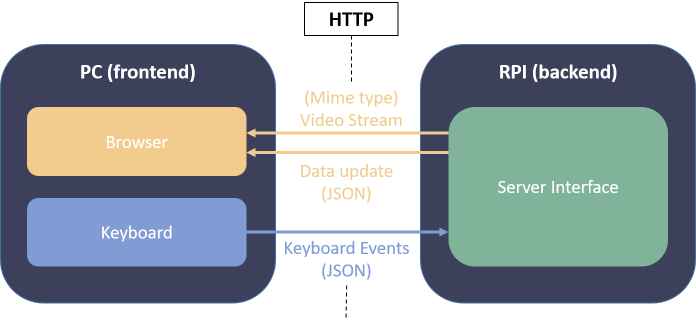
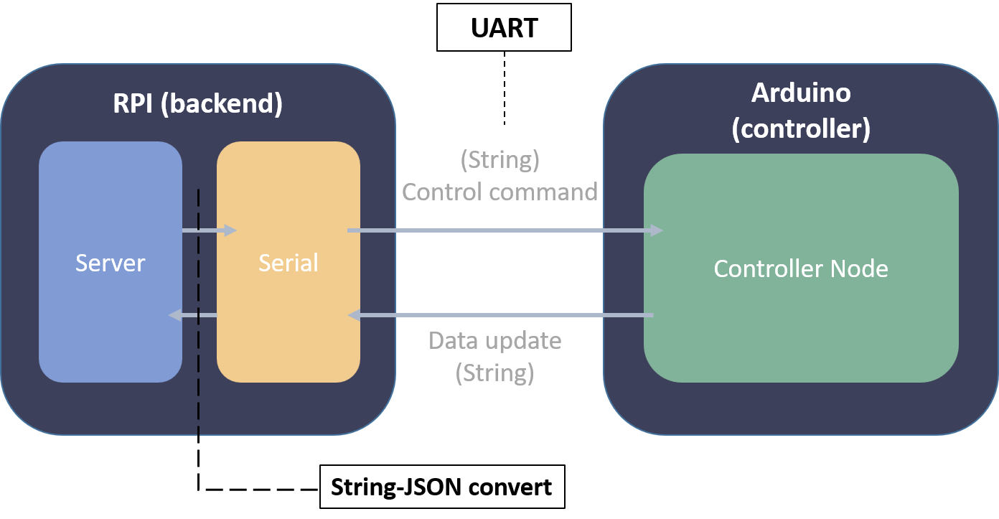
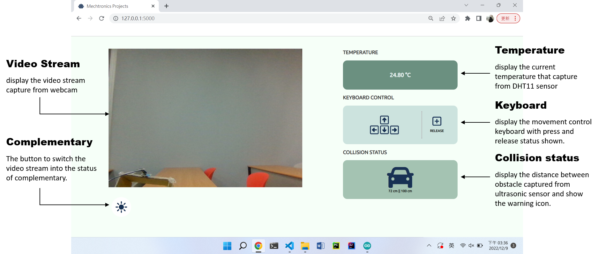
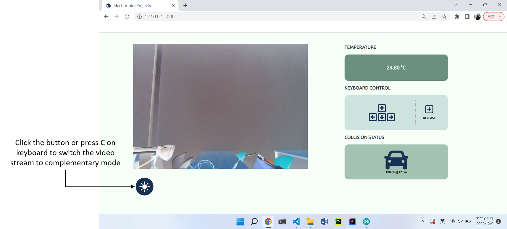
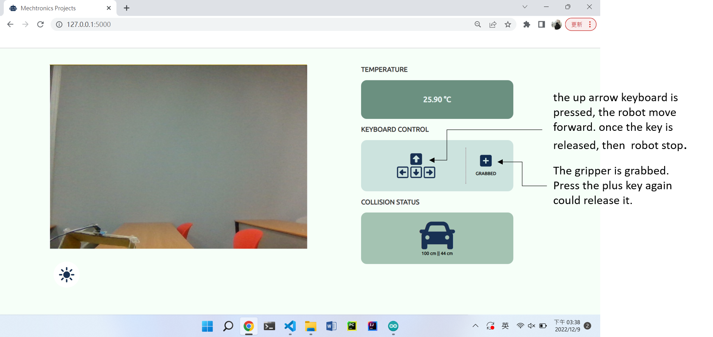
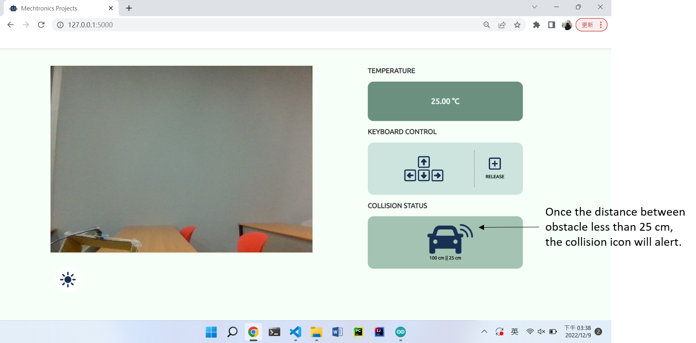

# NTU-Mechatronics
`NTUBME` 、 `Mechatronics`

## System Structure
The system is mainly composed of the core processor (`Raspberr Pi`), controller (`Adruino UNO`), camera, DC motor and driver module, various sensors and corresponding power supply system. Sensors and actuators continuously update data and action commands through the controller, and use serial communication to interact with the computing unit for task options determining and server management. In addition, in the user part, the video stream and the control commands of the computer keyboard are connected to the server side through the wireless network (`Wi-Fi`). Users could control the robot and obtain the status information only to connect the personal laptop to the internal network of the server without having to use multiple devices at the same time.
<br>

<br>

## Software Framework
The software system is mainly composed of three interfaces. `server interface`, `serial interface` and `user interface`. The **server interface** is the main program structure, which is responsible for managing user needs, control commands, and updating robot status; the **serial interface** mainly manages the serial communication between the raspberr pi and the controller; the **user interface** provides users with a comprehensive interface to control the robot and get the information of sensors and cameras. In addition, in order to facilitate the use of various sensors in the system, we package the sensor program part into a program interface (`API`), and provide the interface for the system to use. 
<br>

<br>

## Server Interface
In the server interface, we use Python `Flask`, a lightweight web microframework. Flask is based on `Werkzeug` and `Jinja2` of the `Pocoo` project. It does not have a default database, verification tools, etc. Therefore,  it retains its simple core and flexibility in expansion. At this point, it is also quite beneficial for us to rewrite the core program of the remote control robot.

Besides, on the framework of `Flask`, we have developed several functions that meet the needs of the task, including the transmission of video streams, the the communication interface (referred to in the next section of `serial interface`), the transmission and reception of front-end commands, etc. 

In the part of receiving and transmitting the front-end command, we use the `JSON` data format to achieve it, that is, the back-end server can process the subsequent action options by obtaining the corresponding key value; the server can also jsonify the corresponding data to provide front-end browsers for data access, and this part is mainly interacted with python `Flask` and `JavaScript`.
<br>

<br>

In addition, the video streaming technology used in this software system is an `HTTP multipart` response, the browser can respond accordingly through different `Content-Type` header definitions. The Content-Type we use is `multipart/x-mixed-replace`, which is one of the technologies that Server uses `HTTP` to push streams. It mainly uses the current data block to replace the previous block in the page to achieve screen update. In this way, It looks like a video or animation is playing on the browser.
```
HTTP/1.1 200 OK
Content-Type: multipart/x-mixed-replace; boundary=frame

--frame
Content-Type: image/jpeg

<jpeg data>
--frame
Content-Type: image/jpeg
...
```

## Serial Interface
In addition to the communication between the browser and the server through protocols such as `HTTP`, in order to enable the server to also update the real-time information of the controller, we have designed a communication interface based on `pyserial`, so that the server can process data types through the interface. Processing, and can operate cache and update the data of the controller.
<br>

<Br>
To prevent the controller from occupying program execution while performing other counting tasks (including pulse width modulation and ultrasonic sensors), we periodically transmit current distance, temperature and other information by interrupting `Timer1` of Arduino.
```cpp
ISR(TIMER1_COMPA_vect){
//  String str = "temperature, distance Left, distance right"
    String str = String(temperature) + "," + String(leftDist) + "," + String(rightDist);
    Serial.println(str);
}
```

## User Interface
In order to provide users with a good user experience, we have further beautified our web interface through `JavaScript`, `HTML` and `CSS`. The goal is to provide users with a more intuitive operation mode, and also hope to give users more direct feedback on operation. The user interface is mainly composed of `video streaming` (including complementary color images), current `temperature`, `keyboard feedback` and `collision alert`.
<br>

<br>

In the video streaming block, the real-time video of the camera is displayed by updating the video frame provided by the server. Below the image block, we designed a `button` with a sun icon. Users can click the button or touch the `C` key on the keyboard to achieve the `complementary` color effect of the streaming video.
<br>

<Br>

In the part of keyboard control, we designed the corresponding pressing effect, so that the user can judge whether the command is triggered after hitting the computer keyboard, and confirm the retractable state of the currently touched key and gripper.
<br>

<br>

In addition, we designed the corresponding collision warning effect by updating the ultrasonic sensor information from the server. It is worth noting that our preset warning range is slightly `larger` than the trigger distance of the buzzer, so that users can see the warning screen first, and then hear the sound of the buzzer. The purpose is to provide users with more reaction time and margin of error.
<br>

<br>